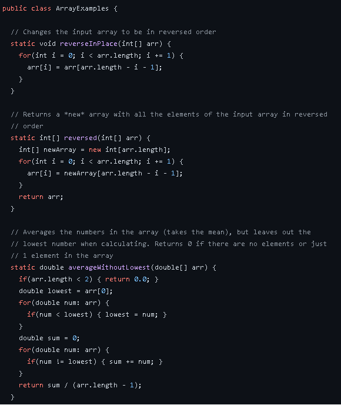
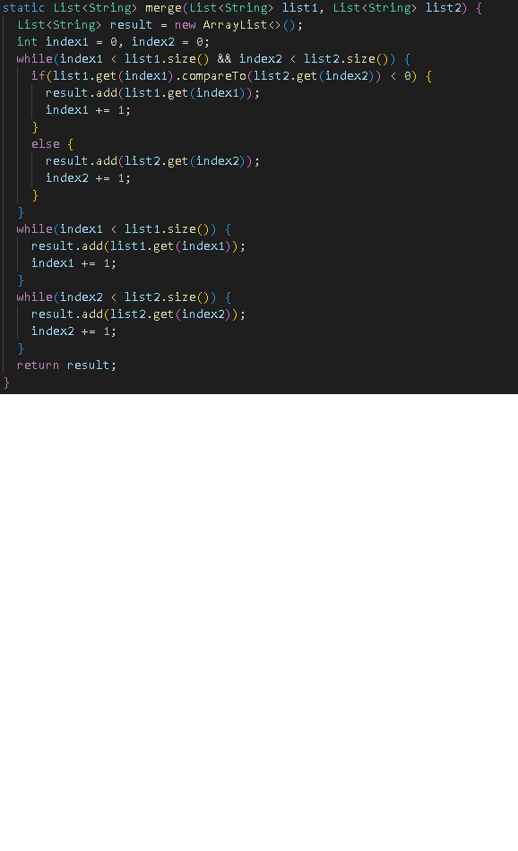

[Lab Report 4](lab-report-4.html)

**Lab Report 2**

**Part 1**

```
class Handler implements URLHandler {
    // The one bit of state on the server: a number that will be manipulated by
    // various requests.
    int num = 0;
    String s1="";
    public String handleRequest(URI url) {
     
        if (url.getPath().equals("/")) {
            return s1;
        } else if (url.getPath().contains("/add")) {
            String[] parameters = url.getQuery().split("=");
            s1 = s1+" "+parameters[1];
            return parameters[1];
        } else if (url.getPath().contains("/search")){
            return s1;
        }
    return "404 Not Found!";
    }
}
```


handleRequest Method will be called and the first else if statement will run. We will store the string after the "=" sign and store it in s1. If the string is changed, s1 will store a different string.


This runs the same method as above but we store a different string "apple" in s1.


handleRequest method is called, and the second else if statement will run. We will show the values in s1. The values in s1 was stored using the first else if statement.

**Part 2**

**ArrayExamples.java**

Here are the code with bugs:



The failure inducing input is {3,4}. The failing test output was {3,3} which should have been {4,3}. The bug was ```arr[i] = arr[arr.length - i - 1];```. I changed the code to the screenshot above. The bug caused that output because the code would only copy the second half of the array to the first half. So the second half of the array stays the same which is 3 for this input.


The failure inducing input is {1,2}. The failing test output was {0,0} which should have been {2,1}. The bug was ```arr[i] = newArray[arr.length - i - 1];```
and ```return arr```. I changed the code to the screenshot above. The bug caused the output because the code would copy an empty array to the original array which would return 0 for all elements of the array. For this input, the returned array would have 0 for all of its elements.


The failure inducing input for this function is {2,2,3,4}. because the method assumes that there is only 1 lowest value so they divide by 3 elements for the mean, which would return 2.33 instead of 3.50. The bug was ``` return sum / (arr.length - 1)```. I changed the code to the screenshot above. I added another for loop to count the number of the lowest element in the array and changed the return statement. The bug caused the ouput because it will assume that there is only 1 lowest value. For this input, the method returns sum divided by 3 instead of 2, which would return 2.33 instead of 3.50.


**ListExamples.java**

Here are the code with bugs:


Failure inducing input for the filter method {apple,APPLE,PINEAPPLE}. The symptom for filter method is as above, the list returned is {PINEAPPLE,APPLE) while expected is {APPLE,PINEAPPLE}. The bug was ```result.add(0, s);```. It always adds the checked string to index 0 of the list. I changed the code to the screenshot above. For this input, the method adds APPLE to index 0 and when it adds PINEAPPLE to index 0 it moves APPLE to index 1. The expected output should have been APPLE in index 0 and PINEAPPLE in index 1.

Failure inducing input for the merge method is l1 = {apple} and l2 = {banana, cilantro, diamond}. The symptom for merge method is that there is a OutOfMemoryError. The bug for this method is:
```
    while(index2 < list2.size()) {
      result.add(list2.get(index2));
      index1 += 1;
    }
```
The code should have been index2+=1. For this input, on the first while loop apple is added to result list. On the while loop above, Since index2 is never incremented the while loop will run infinitely since index2 will never be less than list2.size(). So cilantro is added to the result list infinitely until we run out of memory. 

Here is the change:




